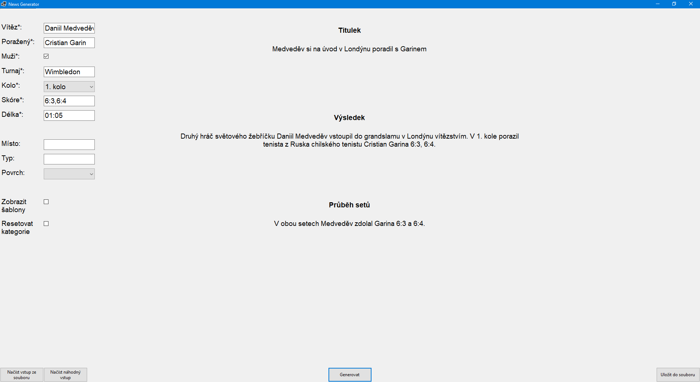

# Generation of tennis singles results

- from a given parameters of a tennis match such as player names and final results generates a short news article in Czech
- for generating the articles we use templates that were automatically extracted from all existing tennis articles of the [Czech News Agency](https://www.ctk.cz/) using hand-crafted rules
- used language tools: [UDPipe](https://ufal.mff.cuni.cz/udpipe) and [MorphoDiTa](https://ufal.mff.cuni.cz/morphodita)

- demo:
  
    

## Project structure

- [CTKNewsParser](CTKNewsParser/) pre-processes existing tennis articles
- [TemplateExtractor](TemplateExtractor/) extracts templates from the pre-processed tennis articles
- [NewsGenerator](NewsGenerator/) based on given parameters generates a short news article
- [StatsAnalyzer](StatsAnalyzer/) analyzes tennis statistics for example to find the line between an even match and a close match
- [WebScraper](WebScraper/) gets information about players such as their current ranking
- [Utility](Utility/) contains language tools